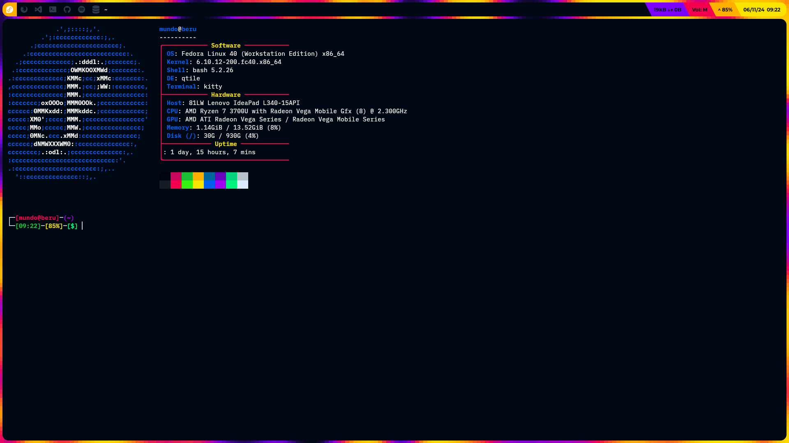
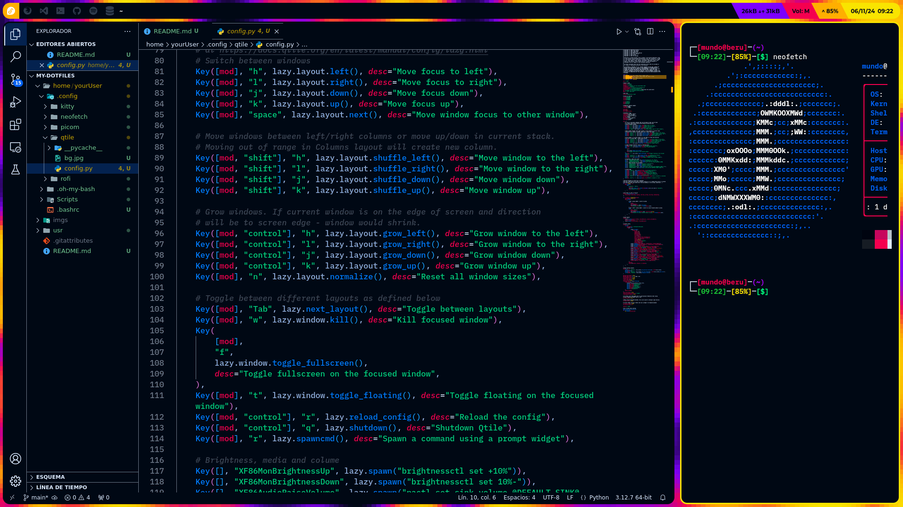

# My Dotfiles

These are the configuration files for my Linux setup. Feel free to use, copy, and modify them as you like!

Quick links to sections in this repo:

 - [Overview](#overview)
     - [Custom keybinds](#custom-keybinds)
 - [Fonts](#fonts)
 - [Screenshots](#screenshots)
 - [Installation](#installation)

## Overview:

These dotfiles enhance the visuals and behavior of the following applications, be sure to have them installed before adding the dotfiles:

 - [**Kitty**](https://sw.kovidgoyal.net/kitty/) *(Terminal emulator)*
 - [**Neofetch**](https://github.com/dylanaraps/neofetch) *(System info)*
 - [**Picom**](https://github.com/yshui/picom) *(Compositor)*
 - [**Qtile**](https://qtile.org/) *(Window manager)*
 - [**Rofi**](https://github.com/davatorium/rofi) *(App launcher)*
 - [**Oh My Bash**](https://github.com/ohmybash/oh-my-bash) *(BASH configuration)*

For a matching VSCode theme, install [Retrowave Sunset](https://marketplace.visualstudio.com/items?itemName=EdCanCe.retrowave-sunset-theme), which matches the color scheme used in the setup.

### Custom keybinds

These are my custom keybinds to execute commands in Qtile:
 - `Super`+`B`: Launch browser.
 - `Super`+`C`: Launch text editor.
 - `Super`+`M`: Launch file manager. 
 - `Super`+`G`: Launch git. 
 - `Super`+`S`: Take screenshot.
 - `Super`+`Shift`+`S`: Take screenshot in selected area.
 - `Super`+`Shift`+`R`: Launch rofi.

## Fonts:

To achieve the same look, make sure to install these fonts:

 - [**IBM Plex Mono**](https://fonts.google.com/specimen/IBM+Plex+Mono?query=ibm+plex+mono) *(Used in terminal and VSCode)*
 - [**Montserrat**](https://fonts.google.com/specimen/Montserrat) *(Used in bar widgets)*
 - [**Nerd Fonts**](https://www.nerdfonts.com/) *(Used in bar icons)*

## Screenshots:

## Installation:

If you desire, make a backup folder containing your current dotfiles.

Be sure to change *"yourUser"* to your username in the 6th line of the `.bashrc` file.
